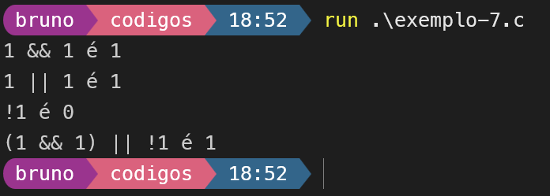
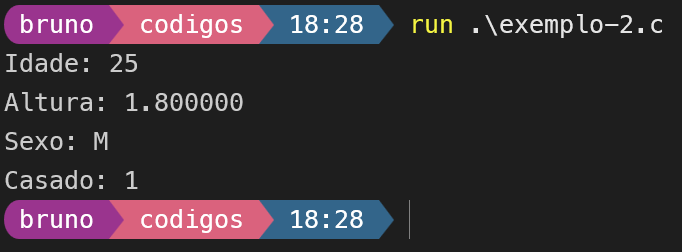
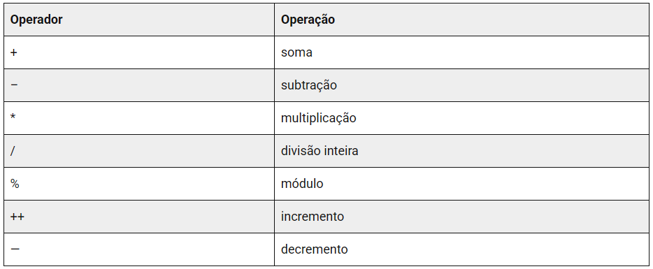
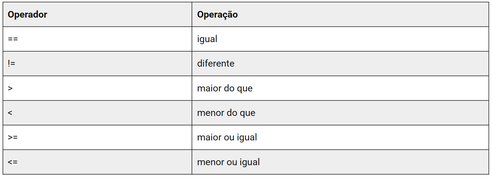
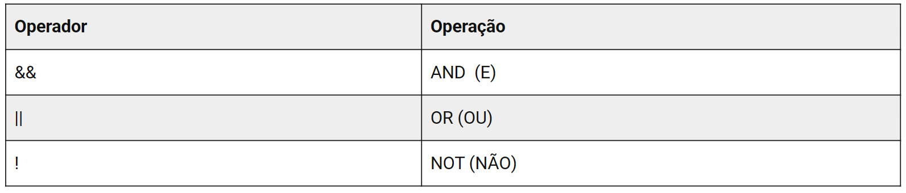
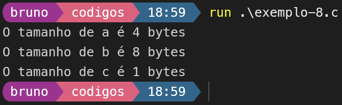
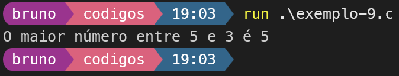
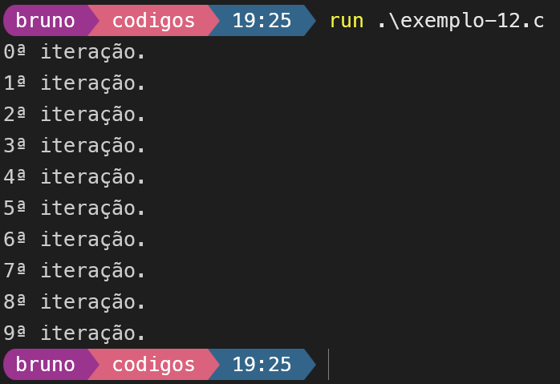
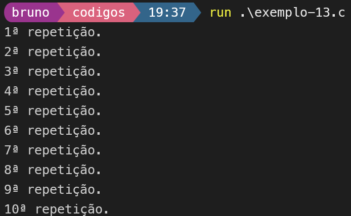
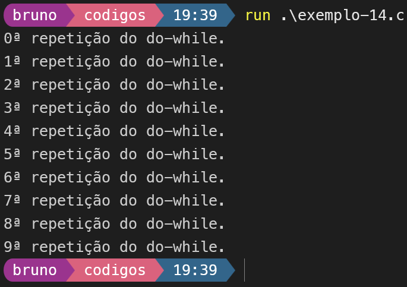

<!-- _class: centered -->
# Lógica de Programação com C

## Introdução a Linguagem de Programação em C

---

## Sumário

1. **Introdução e Conceitos**
2. **Variáveis**
3. **Tipos de Dados**
4. **Operadores aritméticos, relacionais, lógicos e especiais**
5. **Operador ternário**
6. **Estruturas de controle**
7. **Estruturas de repetição**

---

## Introdução sobre a linguagem C

* A linguagem C é uma linguagem de programação de alto nível que foi criada nos anos 1970 para desenvolvimento de sistemas operacionais.

* Ela é amplamente utilizada em sistemas embarcados.

---

## Variáveis

As variáveis são locais de armazenamento em memória onde os dados podem ser armazenados e manipulados durante a execução de um programa.

```c
#include <stdio.h>

int main(void) {
  int idade;
  idade = 25;
  printf("Minha idade é: %d\n", idade);
  return 0;
}
```

A variável “idade” é declarada como um inteiro e então atribuída o valor 25 “idade = 25”.
O valor da variável “idade” é então exibido através da função printf().

---

## Tipos de dados (1/2)

A linguagem C possui vários tipos de dados, como inteiros, ponto flutuante, caracteres e booleanos.

```c
#include <stdio.h>

int main(void) {
  int idade = 25;
  float altura = 1.80;
  char sexo = 'M';
  _Bool casado = 1;
  printf("Idade: %d\nAltura: %f\nSexo: %c\nCasado: %d\n", idade, altura, sexo, casado);
  return 0;
}
```

São declaradas quatro variáveis de diferentes tipos. Cada uma delas é atribuída um valor apropriado e, em seguida, é exibida na tela através da função printf().

---

## Tipos de dados (2/2)

O resultado da execução deste programa:

<!--  -->


---

## Operadores aritméticos

Os operadores são símbolos utilizados para realizar operações matemáticas e lógicas. Os operadores aritméticos são usados para realizar operações matemáticas básicas em C, como adição, subtração, multiplicação e divisão.



---

## Operadores aritméticos: Exemplo 1

```c
#include <stdio.h>
#include <locale.h>

int main(void) {
    setlocale(LC_ALL, ".UTF8");
    int a = 5, b = 3;

    printf("soma de %d e %d é %d\n", a, b, a + b); // int soma = a + b;
    printf("subtracao de %d e %d é %d\n", a, b, a - b); // int subtracao = a - b;
    printf("multiplicação de %d e %d é %d\n", a, b, a * b); // int mult = a * b;
    printf("divisao de %d e %d é %d\n", a, b, a / b); // int divisao = a / b;

    return 0;
}
```

---

## Operadores aritméticos: Exemplo 2

```c
#include <stdio.h>
#include <locale.h>

int main(void) {
    setlocale(LC_ALL, ".UTF8");
    int a = 5, b = 3;

    int mod = a % b;
    printf("resto da divisão de %d e %d é %d\n", a, b, mod);

    a++;
    printf("incremento: %d\n", a);
    b--;
    printf("decremento: %d\n", b);

    return 0;
}
```

---

## Operadores relacionais

Os operadores relacionais são usados para comparar dois valores em C e produzir um valor lógico **verdadeiro(1)** ou **falso(0)** como resultado.



---

## Operadores relacionais: Exemplo 1

```c
#include <stdio.h>
#include <locale.h>

int main(void)
{
    setlocale(LC_ALL, ".UTF8");
    int a = 5, b = 3;
    int resultado = (a == b); // Igualdade
    printf("%d == %d é %d\n", a, b, resultado);
    resultado = (a != b); // Diferença
    printf("%d != %d é %d\n", a, b, resultado);
    resultado = (a > b); // Maior
    printf("%d > %d é %d\n", a, b, resultado);

    return 0;
}
```

---

## Operadores relacionais: Exemplo 2

```c
#include <stdio.h>
#include <locale.h>

int main(void)
{
    setlocale(LC_ALL, ".UTF8");
    int a = 5, b = 3, resultado;
    resultado = (a < b); // Menor
    printf("%d < %d é %d\n", a, b, resultado);
    resultado = (a >= b); // Maior ou igual
    printf("%d >= %d é %d\n", a, b, resultado);
    resultado = (a <= b);    // Menor ou Igual
    printf("%d <= %d é %d\n", a, b, resultado);

    return 0;
}
```

---

## Operadores lógicos

Os operadores lógicos são usados para combinar expressões booleanas em C e produzir um valor lógico (verdadeiro ou falso) como resultado.



---

## Operadores lógicos: Exemplo

```c
#include <stdio.h>
#include <locale.h>

int main(void) {
    setlocale(LC_ALL, ".UTF8");
    int a = 1, b = 1;
    int resultado = (a && b); // AND (E)
    printf("%d && %d é %d\n", a, b, resultado);
    resultado = (a || b); // OR (OU)
    printf("%d || %d é %d\n", a, b, resultado);
    resultado = !a; // NOT (NÃO)
    printf("!%d é %d\n", a, resultado);
    resultado = (a && b) || !a; // Combinação de operadores lógicos
    printf("(%d && %d) || !%d é %d\n", a, b, a, resultado);
    return 0;
}
```

---

## Operadores lógicos: Resultado

Resultado da execução do exemplos anterior.


---

## Operadores especiais

O operador sizeof() é usado para descobrir o tamanho, em bytes, de uma variável ou tipo de dados em C. Ele é útil para determinar o espaço de armazenamento necessário para uma determinada variável ou estrutura.

---

## Operadores especiais: Exemplo

```c
#include <stdio.h>
#include <locale.h>

int main(void)
{
    setlocale(LC_ALL, ".UTF8");
    int a = 5;
    printf("O tamanho de a é %lu bytes\n", sizeof(a));

    double b = 3.14;
    printf("O tamanho de b é %lu bytes\n", sizeof(b));

    char c = 'x';
    printf("O tamanho de c é %lu bytes\n", sizeof(c));

    return 0;
}
```

---

## Operadores especiais: Resultado



---

## Operador Ternário

* O operador ternário é um operador condicional que permite escrever expressões condicionais de maneira concisa e legível.

* Ele é composto por três partes

  * Uma expressão condicional, seguida de um ponto de interrogação (?), seguida de;

  * Uma expressão a ser avaliada caso a expressão condicional seja verdadeira, e um dois-pontos (:)

  * seguido de uma expressão a ser avaliada caso a expressão condicional seja falsa. A sintaxe geral é:

  `condição ? expressão1 : expressão2`

---

## Operador Ternário: Exemplo

```c
#include <stdio.h>
#include <locale.h>

int main(void)
{
    setlocale(LC_ALL, ".UTF8");
    int a = 5, b = 3;
    int maior = (a > b) ? a : b;
    printf("O maior número entre %d e %d é %d\n", a, b, maior);

    return 0;
}
```

---

## Operador Ternário: Resultado



Neste exemplo, a expressão condicional “(a > b)” é avaliada, e:

* Caso seja verdadeira, a expressão “a” é avaliada e armazenada na variável ‘maior’.
* caso contrário, a expressão “b” é avaliada e armazenada na variável ‘maior’

---

## Estruturas de controle de fluxo

As estruturas de controle de fluxo são usadas para controlar a execução de um programa, permitindo que ele execute diferentes ações de acordo com determinadas condições.

---

## if, if-else

A instrução “if” é uma estrutura de controle de fluxo que permite que você execute diferentes trechos de código com base em uma determinada condição. A sintaxe geral é:

```c
if (condicao) {
    // código a ser executado se a condição for verdadeira
}
```

Você pode incluir uma instrução “else” opcional para especificar o código a ser executado se a condição for falsa:

```c
if (condicao) {
    // código a ser executado se a condição for verdadeira
} else {
    // código a ser executado se a condição for falsa
}
```

---

## if, if-else: Exemplo (1/2)

Aqui está um exemplo de como usar a instrução “if” em C:

```c
#include <stdio.h>
#include <locale.h>

int main(void)
{
    setlocale(LC_ALL, ".UTF8");
    int idade = 30;
    if (idade < 18) {
        printf("Você é menor de idade.\n");
    }
    else {
        printf("Você é maior de idade.\n");
    }
    return 0;
}
```

---

## if, if-else: Exemplo (2/2)

Neste exemplo, a condição “idade < 18” é avaliada, e se for verdadeira, o código dentro do primeiro bloco de chaves é executado e imprime “Você é menor de idade.”, senão, o código dentro do segundo bloco é executado e imprime “Você é maior de idade.”

---

## else-if: Exemplo (2/2)

Além disso, você pode adicionar mais de um “if” e “else” para criar múltiplas condições ou incluir uma estrutura “else if” para adicionar mais condições e evitar a necessidade de aninhar vários ifs.

```c
if (idade < 18) {
    printf("Você é menor de idade.\n");
} else if (idade >= 18 && idade <= 30) {
    printf("Você é jovem adulto.\n");
}else {
    printf("Você é adulto.\n");
}
```

---

## switch

A instrução “switch” é uma estrutura de controle de fluxo que permite que você execute diferentes trechos de código com base em um valor de expressão. A sintaxe geral é:

```c
switch (expressão) {
case valor1:
    // código a ser executado se a expressão for igual a valor1
    break;
case valor2:
    // código a ser executado se a expressão for igual a valor2
    break;
default:
    // código a ser executado se nenhum dos valores acima for igual a expressão
}
```

---

## switch: Explicação

A expressão é avaliada e comparada com cada um dos valores “case”. Quando um valor é encontrado que é igual à expressão, o código dentro do bloco correspondente é executado. A palavra-chave “break” é usada para sair do bloco e continuar a execução do código após o switch.

Se nenhum dos valores “case” for igual à expressão, o código dentro do bloco “default” será executado, se houver. Se não houver um bloco “default”, o código após o switch será executado sem entrar em nenhum dos case.

---

## switch: Exemplo

```c
#include <stdio.h>
#include <locale.h>

int main(void) {
    setlocale(LC_ALL, ".UTF8");
    char opcao = 'B';
    switch (opcao) {
    case 'A':
        printf("Opção A escolhida.\n");
        break;
    case 'B':
        printf("Opção B escolhida.\n");
        break;
    default:
        printf("Opção inválida.\n");
    }
    return 0;
}
```

---

## Estruturas de repetição

As estruturas de repetição de fluxo são usadas para controlar a repetição da execução de parte de um programa, permitindo que ele execute mais de uma veez de acordo com determinadas condições.

---

## for

A instrução “for” é uma estrutura de controle de fluxo que permite que você execute um trecho de código repetidamente enquanto uma determinada condição for verdadeira. A sintaxe geral é:

```c
for (inicialização; condição; incremento) {
    // código a ser executado enquanto a condição for verdadeira
}
```

A inicialização é executada uma vez no início do loop, a condição é verificada antes de cada iteração, e o incremento é executado após cada iteração. Se a condição for verdadeira, o código dentro do bloco será executado. Se a condição for falsa, o loop é interrompido e a execução continua após o loop.

---

## for: Exemplo

```c
#include <stdio.h>
#include <locale.h>

int main(void) {
    setlocale(LC_ALL, ".UTF8");
    for (int i = 0; i < 10; i++) {
        printf("%d\n", i);
    }
    return 0;
}
```

Neste exemplo, a variável “i” é inicializada com o valor 0, a condição “i < 10” é verificada antes de cada iteração, e o incremento “i++” é executado após cada iteração. O código dentro do loop imprime o valor de “i” em cada iteração, e o loop é executado 10 vezes, até que a condição “i < 10” se torne falsa.

---

## for: Resultado



---

## while

A instrução “while” é uma estrutura de controle de fluxo que permite que você execute um trecho de código repetidamente enquanto uma determinada condição for verdadeira. A sintaxe geral é:

```c
while (condição) {
    // código a ser executado enquanto a condição for verdadeira
}
```

A condição é verificada antes de cada iteração. Se a condição for verdadeira, o código dentro do bloco será executado. Se a condição for falsa, o loop é interrompido e a execução continua após o loop.

---

## while: Exemplo

```c
#include <stdio.h>
#include <locale.h>

int main(void) {
    setlocale(LC_ALL, ".UTF8");
    int i = 1;
    while (i <= 10) {
        printf("%dª repetição.\n", i);
        i++;
    }
    return 0;
}
```

A variável “i” é inicializada com 0, a condição “i < 10” é verificada antes de cada iteração. O código dentro do loop imprime o valor de “i” e incrementa “i++” a cada iteração e o loop é executado até que a condição “i < 10” se torne falsa.

---

## while: Explicação



---

## do-while

A instrução “do-while” é uma estrutura de controle de fluxo semelhante à instrução “while”, mas com uma diferença importante: o código dentro do loop é executado pelo menos uma vez, independentemente da condição. A sintaxe geral é:

```c
do {
    // código a ser executado
} while (condição);
```

A condição é verificada após cada iteração. Se a condição for verdadeira, o código dentro do bloco será executado novamente. Se a condição for falsa, o loop é interrompido e a execução continua após o loop.

---

## do-while: Exemplo

```c
#include <stdio.h>
#include <locale.h>

int main(void)
{
    setlocale(LC_ALL, ".UTF8");
    int i = 0;
    // executa pelo menos uma vez
    do {
        printf("%dª repetição do do-while.\n", i);
        i++;
    } while (i < 10);
    return 0;
}
```

---

## do-while: Resultado



---

## do-while: Explicação

Neste exemplo, a variável “i” é inicializada com o valor 0, e o código dentro do loop imprime o valor de “i” em cada iteração, e o incremento “i++” é executado após cada iteração. A condição “i < 10” é verificada após cada iteração e o loop é executado até 10 vezes, até que a condição se torne falsa.

A nota que é importante que a variável “i” seja atualizada dentro do loop, para que ele não execute infinitamente.

O laço “do-while” é útil para situações onde você precisa garantir que o código dentro do loop seja executado pelo menos uma vez, independentemente da condição.

---

## Executando programa em C

Para executar arquivos com código em C, pasta usar o seguinto comando.

Linux:
`gcc exemplo-10.c -o exemplo-10` e `./exemplo-10`

Windows:
`gcc .\exemplo-10.c -o .\exemplo-10` e `.\exemplo-10.exe`

* Obs: no windows, será gerado um executável com o nome do .c que foi compilado.

---

## Ferramentas

Independente de ser no windows ou linux, essas serão as principais ferramentas a partir de agora.

* Manual para consulta, link [aqui](https://github.com/silv4bufersa/lab-algoritmos-ufersa/blob/main/manual-c/manual.pdf).
* gcc (MSYS2 MINGW64), caso esteja no windows, link [aqui](https://youtu.be/SfzOniNeayc).
* Visual Studio Code, link [aqui](https://code.visualstudio.com/).
* Git/Github, link do git [aqui](https://git-scm.com/install/) e do github [aqui](https://github.com/).
* Compilador online de C, link [aqui](https://www.onlinegdb.com/).

---

## A seguir

* **Strings**
* **Vetores**
* **Funções**
* **Matrizes**
* **Ponteiros (se der 👏🏾)**
